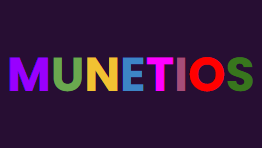

# Munetios Search

<div align="center">
  
  
  <p><strong>A privacy-focused search engine with offline capabilities</strong></p>
  
  
</div>

## 🔍 Overview

Welcome to **Munetios Search** — a beautiful, privacy-focused search engine that lets you search the web without being tracked. Built with a stunning liquid glass UI design, Munetios provides a modern and premium search experience.

### ✨ Key Features

- 🔒 **Private Search** - Search without being tracked or monitored
- 📴 **Offline Capability** - Search even when you're offline with service worker support
- 🎨 **Beautiful UI** - Modern liquid glass design with purple gradient themes
- 🚀 **Fast & Responsive** - Optimized for speed and performance
- 🔖 **Quick Links** - Easy access to popular websites (Google, YouTube, Microsoft, ChatGPT, etc.)
- 🎙️ **Voice Search** - Search using your voice
- ⚙️ **Customizable** - Personalize your search experience
- 🎮 **Built-in Games** - Includes Pac-Man and other games for entertainment

## 📸 Screenshots

### Homepage


The main search interface features:
- Colorful Munetios logo
- Clean search bar with voice input
- Quick access shortcuts to popular websites
- Customizable quick links
- "I'm Feeling Good" button for lucky search

### About Page


Learn more about:
- Company information and mission
- UI design philosophy
- Available apps and features
- Privacy and safety commitments

## 🚀 Getting Started

### Prerequisites

This is a static website that requires only a web server to run. You can use:
- Python's built-in HTTP server
- Node.js `http-server`
- Any static file hosting service

### Local Development

1. **Clone the repository**
   ```bash
   git clone https://github.com/Munetios/Munetios-Search.git
   cd Munetios-Search
   ```

2. **Start a local server**
   
   Using Python 3:
   ```bash
   python3 -m http.server 8080
   ```
   
   Or using Python 2:
   ```bash
   python -m SimpleHTTPServer 8080
   ```
   
   Or using Node.js:
   ```bash
   npx http-server -p 8080
   ```

3. **Open in browser**
   ```
   http://localhost:8080
   ```

## 🎨 Design Philosophy

Munetios features a unique **liquid glass** design that is:
- **SUPER BEAUTIFUL!** - Eye-catching and modern aesthetics
- **Premium** - High-quality visual experience
- **Powerful** - Feature-rich functionality

### Design Specifications
- **Fonts**: Google Sans Flex, Lexend, Poppins
- **Colors**: Purple (#190047), Dark Purple, White, Blue
- **Style**: Liquid glass effects with backdrop blur

## 🛠️ Technology Stack

- **HTML5** - Semantic markup
- **CSS3** - Custom styles with liquid glass effects
- **JavaScript** - Progressive Web App functionality
- **Service Workers** - Offline support
- **OpenSearch** - Browser search integration

## 📁 Project Structure

```
Munetios-Search/
├── index.html              # Main homepage
├── about.html              # About page
├── search/                 # Search functionality
├── games/                  # Built-in games
├── apps/                   # Additional apps
├── maze/                   # Maze game
├── policies/               # Terms and privacy policies
├── screenshots/            # Documentation screenshots
├── sw.js                   # Service worker for offline support
├── opensearch.xml          # OpenSearch description
├── Munetios-Logo.png       # Brand logo
└── readme.md               # This file
```

## 🌐 Live Demo

Visit the live site at: [https://www.munetios.com](https://www.munetios.com)

## 🔐 Privacy & Security

Munetios is committed to user privacy:
- **No tracking** - Your searches are not monitored or logged
- **No data selling** - Your information is never sold to third parties
- **Secure by design** - Built with security best practices
- **Content Security Policy** - Protection against XSS attacks
- **X-Frame-Options** - Clickjacking protection

## 📱 Progressive Web App

Munetios can be installed as a Progressive Web App (PWA):
- Works offline with cached content
- Can be added to your home screen
- Fast loading with service worker caching
- Responsive design for all devices

## 🤝 Contributing

Contributions are welcome! Please feel free to submit a Pull Request.

1. Fork the repository
2. Create your feature branch (`git checkout -b feature/AmazingFeature`)
3. Commit your changes (`git commit -m 'Add some AmazingFeature'`)
4. Push to the branch (`git push origin feature/AmazingFeature`)
5. Open a Pull Request

## 📄 License

This project is open source under the **MIT License (with Brand Protection)**.

You are free to use and modify the code, but may not rebrand it as "Munetios" or use the Munetios logo/name in derivative projects.

### Trademark Notice

**Munetios** and the Munetios logo are currently not registered trademarks. However, trademark registration may be pursued in the future to protect our brand identity. Please respect the use of our name and logo in accordance with applicable laws.

## 📞 Contact & Links

- **Website**: [https://www.munetios.com](https://www.munetios.com)
- **Blog**: [https://blog.munetios.com](https://blog.munetios.com)
- **Discord**: [Join our community](https://discord.gg/GXRK3pDfR3)
- **GitHub**: [Munetios Organization](https://github.com/munetios)

## 🏢 About Munetios Technologies

**Founded**: January 12, 2025  
**Location**: Abington, Massachusetts, United States

Munetios Technologies creates beautiful, privacy-focused web applications including Search, Photos, Calendar, Notes, Tasks, Weather, Calculator, Tetris, Docs, and more.

---

<div align="center">
  <p>Made with ❤️ by Munetios Technologies</p>
  <p>© 2025 Munetios Technologies. All rights reserved.</p>
</div>
